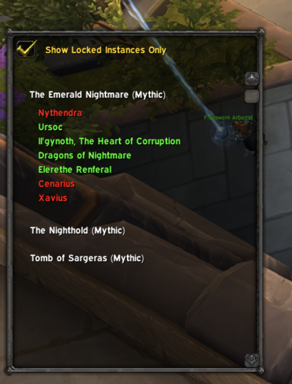

# Boss Tracker

Shows bosses that have died in locked instances. Made to make sure I kill everything I need to when hunting transmogs.

# Usage

Use `/bosstracker` to show or hide the Boss Tracker Frame.

Use the checkbox to only show instances that are locked for this lockout.

Click an instance to show killed (red) and unkilled (green) bosses.

# TODO

* Update the boss kills as they happen - the strategy of relying on the API doesn't work since it doesn't update immediateley
* Remember the expanded sections

# Screenshot

